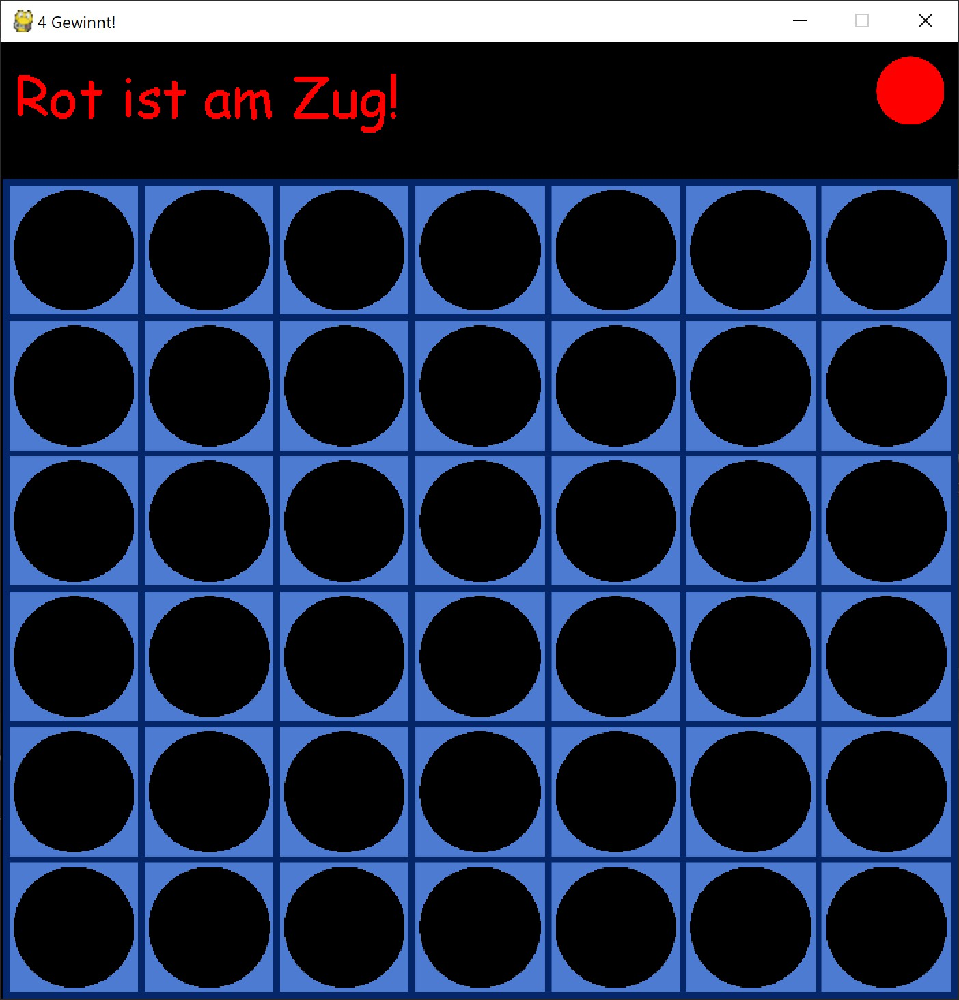
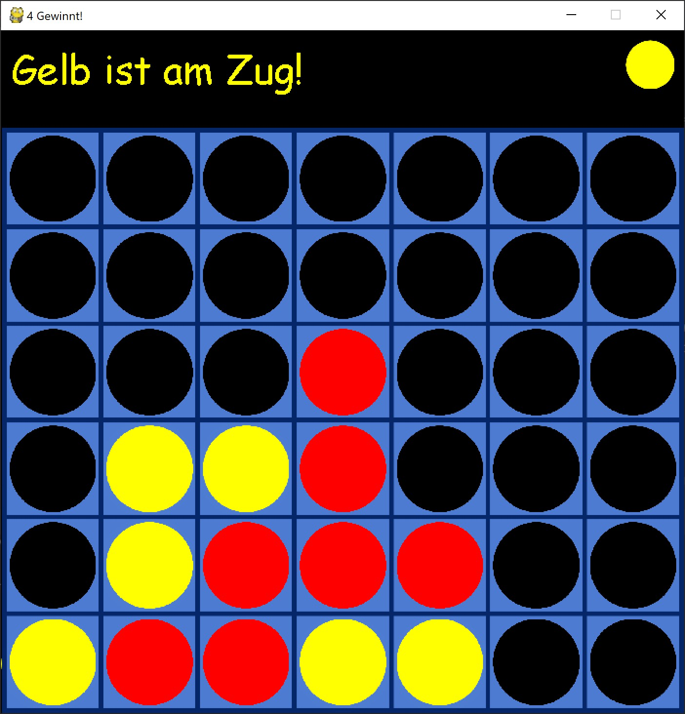
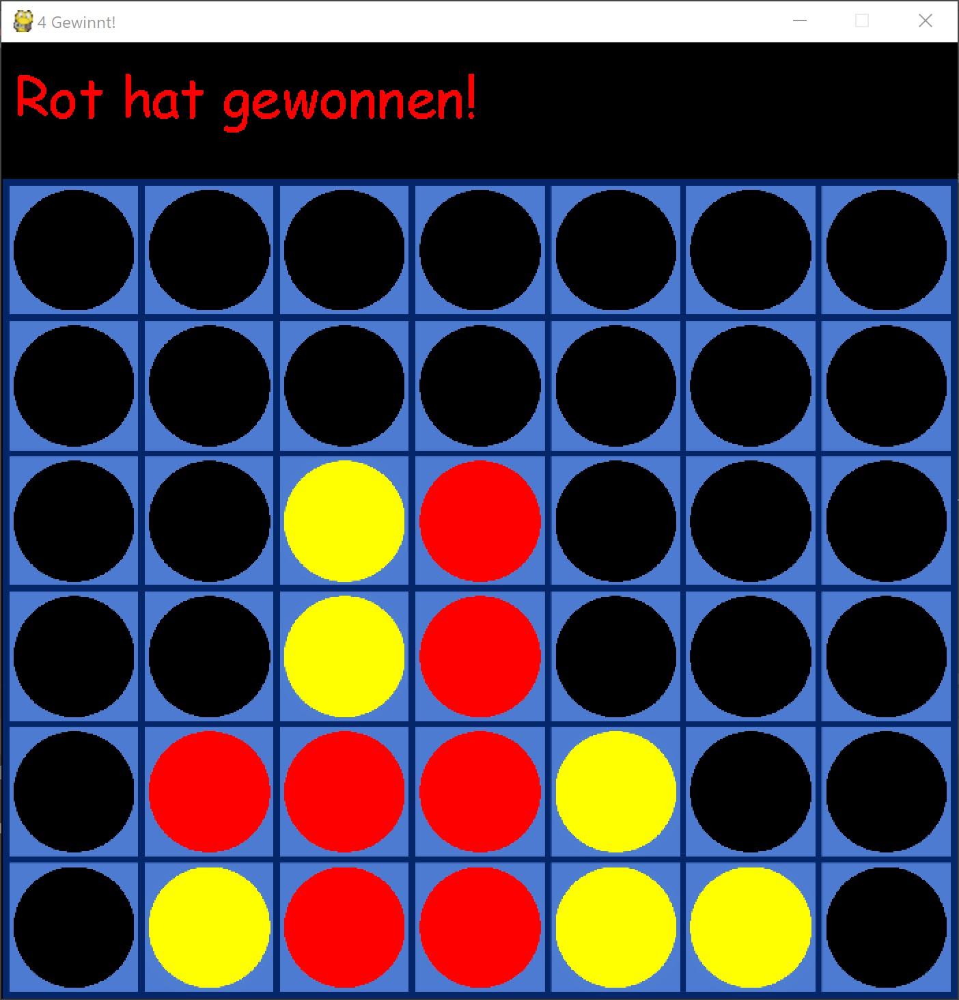
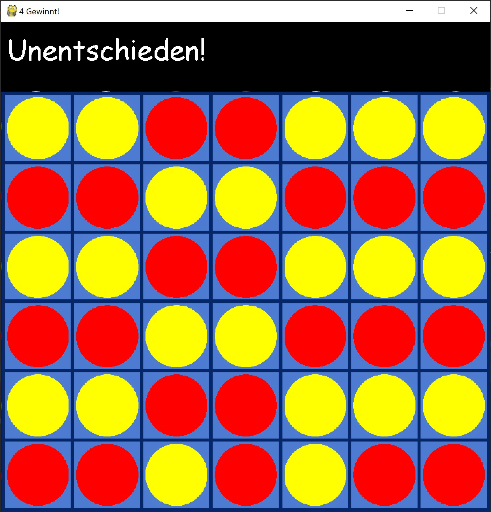

# Mini Game Connect4

## General Informations
This is an implementation of the game "Connect4" in Python using two classes. For the graphical user interface the module "pygame" was used.

The user can set a chip by clicking on the desired column. The chip is falling down the column until it hits another one. If the desired column is filled completely with chips, the user is not able to drop an additional chip on top. 

The winner is the first who got 4 chips in a row (horizontal, vertical or diagonal).

## Images / Screenshots
</img> 
</img> 
</img> 
</img>