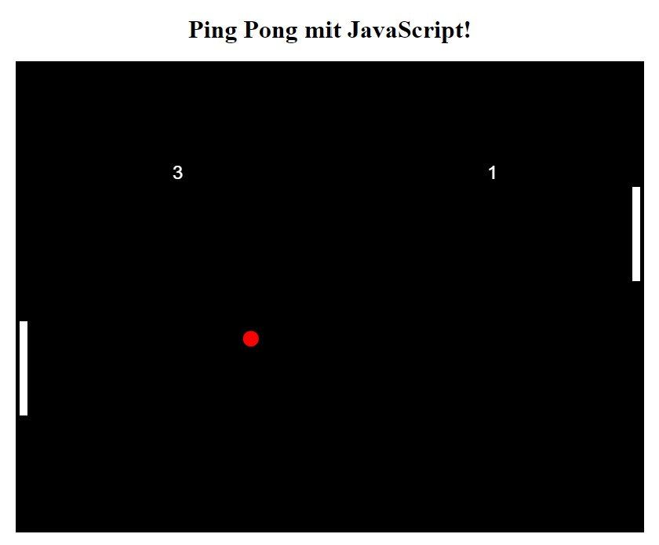
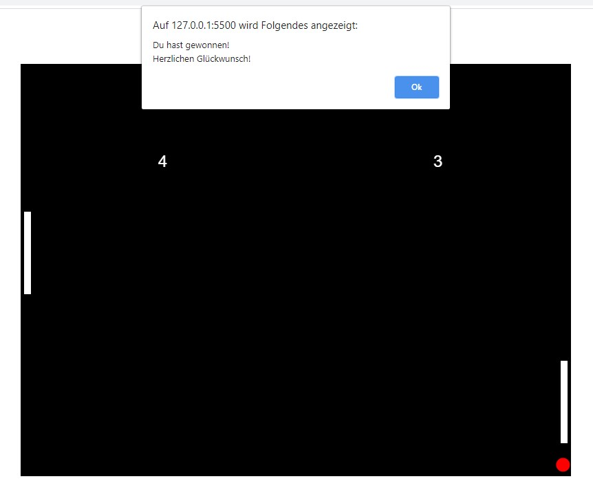

# Mini Game PingPong

## General Informations
This is an implementation of the game "Ping Pong". Written in JavaScript the game can be played in the browser calling the index.html file. For the graphical user interface a html-canvas area was used.

The user can move the left paddle with its mouse position. Depending on the position the ball hits the paddle, the ball will bounce off in another angle. For example: If the ball hits the paddle on the upper area, the ball will bounce to the top of the gamefield. However, if the ball hits the paddle on the lower side, the ball will bounce to the lower side of the gamefield. The right paddle is moved by a computer algorithm. That the game gets a little bit harder to play, the speed increases after defined time intervals.

The winner is the first, who reached 5 goals.

## Image / Screenshot
</img> 
</img>