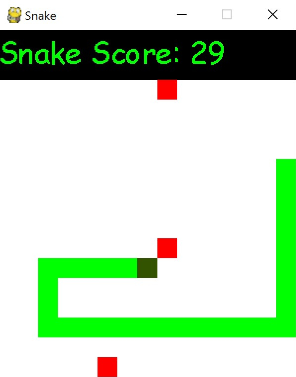

# Mini Game Snake

## General Informations
This is an object orientated implementation of the game "Snake" in Python. The classes are saved in the files of the same name. For the graphical user interface the module "pygame" and "tkinter" were used.

The user can move the snake with the arrow-keys on the keyboard. If the snake hits a fruit, the snake eats it and grows for the size of the food.

However, if the snake hits itself or the boundaries of the gamefield, it dies and the game will restart.

## Images / Screenshots
</img>
</img>
</img>